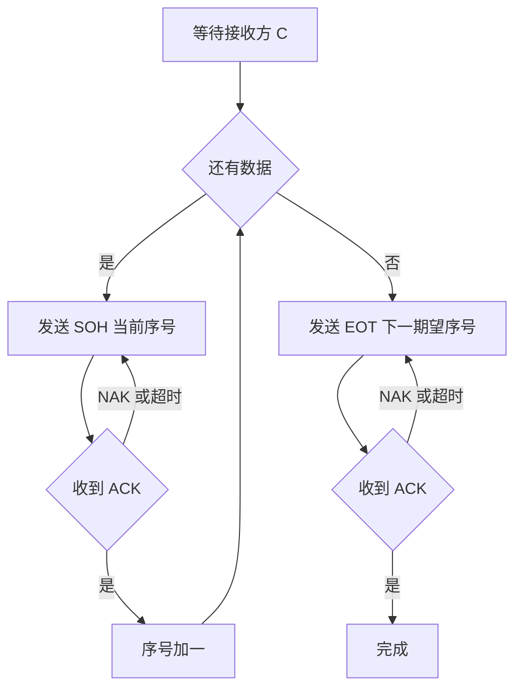
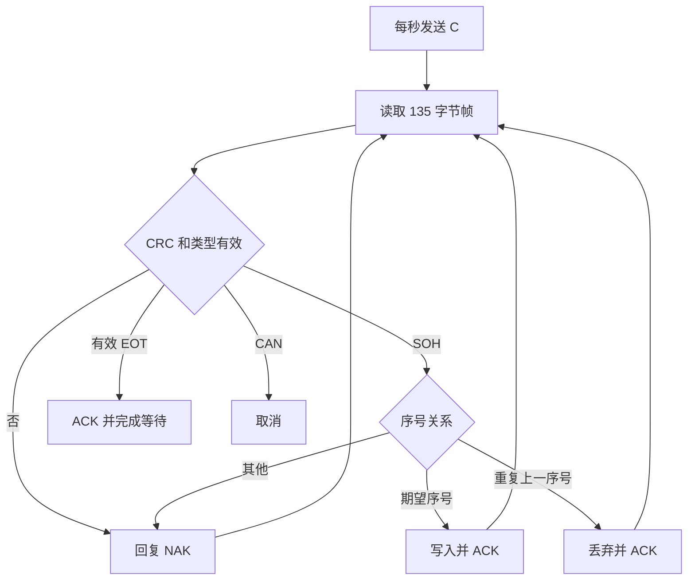

# FFRTP-128 固定帧可靠传输协议 V1.0

FFRTP 是 Fixed-Frame Reliable Transfer Protocol 的缩写；128 表示每个 SOH 数据帧承载 128 字节文件数据。本协议面向 UART 或 RS485 有序字节链路，任意一端均可作为发送方或接收方，但一次传输必须一端发送、另一端接收。

## 核心约束

- 串口默认采用 8N1，波特率由双方预先约定。
- 文件长度必须是 128 字节的整数倍；不传输文件名或独立长度字段。
- SOH、EOT、CAN 都是 135 字节完整帧。
- 每帧独立计算 CRC16；不计算整文件 CRC。
- 数据序号从 0 开始，使用 32 位无符号整数，小端编码，不循环。
- EOT 序号等于接收端的下一个期望序号，并且必须收到 ACK。
- 单次等待 1 秒；首次尝试后最多重试 60 次。

## 控制值

| 名称 | 数值 | 方向 | 含义 |
|---|---:|---|---|
| SOH | `0x01` | 发送方到接收方 | 数据帧 |
| EOT | `0x04` | 发送方到接收方 | 结束完整帧 |
| CAN | `0x18` | 发送方到接收方 | 取消完整帧 |
| C | `0x43` | 接收方到发送方 | 请求开始 CRC16 模式传输 |
| ACK | `0x06` | 接收方到发送方 | 当前数据帧或 EOT 成功 |
| NAK | `0x15` | 接收方到发送方 | 要求重发 |

C、ACK、NAK 是单字节应答；发送方发出的 SOH、EOT、CAN 是完整帧。

## 135 字节帧格式

| 偏移 | 长度 | 字段 | 编码 |
|---:|---:|---|---|
| 0 | 1 | 帧类型 | SOH、EOT 或 CAN |
| 1 至 4 | 4 | 包序号 | `uint32_t` 小端 |
| 5 至 132 | 128 | 数据区 | SOH 为文件数据；EOT/CAN 填充 `0xFF` |
| 133 至 134 | 2 | CRC16 | 高字节在前，覆盖偏移 0 至 132 |

CRC 使用 CRC16-CCITT-FALSE：多项式 `0x1021`，初值 `0xFFFF`，不反转，结果异或 `0x0000`。字符串 `123456789` 的参考结果为 `0x29B1`。

## 序号、重复包与结束

接收方保存 `expected_seq`：

- `seq == expected_seq`：校验通过后写入 128 字节，`expected_seq += 1`，回复 ACK。
- `seq == expected_seq - 1`：判定为 ACK 丢失导致的重复包；丢弃数据，不递增，再次回复 ACK。
- 其他序号：回复 NAK，状态保持不变。
- `EOT.seq == expected_seq`：回复 ACK 并进入完成等待状态。
- 在完成等待状态收到相同 EOT：再次回复 ACK，以恢复丢失的最终 ACK。

文件长度由成功接收的数据包数量推导：`file_size = expected_seq * 128`。空文件使用序号 0 的 EOT。

## 发送方流程



等待 C、数据帧和 EOT 均使用 1 秒超时与 60 次最大重试。超过限制时发送 CAN 并报告失败。

## 接收方流程



接收端必须先在临时帧缓冲区完成 CRC 和序号检查，再修改目标内存或 Flash。写入失败时不得回复 ACK。

## Python 唯一入口

```python
from ffrtp128 import transfer

# bytes 表示发送
source = open("firmware.bin", "rb").read()
result = transfer(source, "COM3", 115200)

# bytearray 表示接收
destination = bytearray()
result = transfer(destination, "COM3", 115200)
open("received.bin", "wb").write(destination)
```

## 实施边界

本版本适用于有序、低延迟的 UART 或 RS485 链路。它不传输文件名、时间戳、权限、版本号或整文件 CRC；固件合法性、Flash 写后校验等由应用层负责。对于可能乱序、长期缓存或跨网络转发的链路，应把应答扩展为带序号和 CRC 的完整帧。
